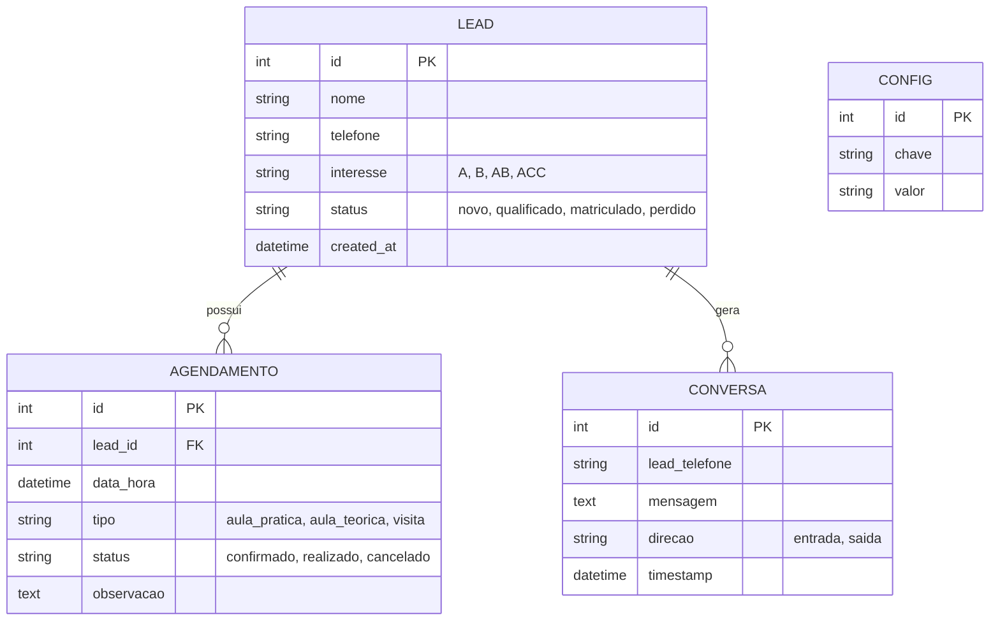

# Plano de Implementação — Bot WhatsApp para Auto Escola

---

## 1. Engenharia de Requisitos

### 1.1 Visão Geral
Sistema automatizado via WhatsApp Web para atendimento de alunos e lead de auto escola, operando 24/7 com respostas inteligentes, agendamento de aulas e gestão de matrículas.

### 1.2 Stakeholders
| Stakeholder | Papel |
|---|---|
| Proprietário/Diretor da Auto Escola | Sponsor, aprova requisitos |
| Instrutores | Usuários impactados (recebem leads) |
| Secretária/Administrativo | Operadora do sistema (dashboard) |
| Alunos/Leads | Usuários finais do bot |
| TI / Desenvolvedor | Implementação e manutenção |

### 1.3 Requisitos Funcionais (RF)

| ID | Descrição | Prioridade |
|---|---|---|
| RF01 | O bot deve cumprimentar e se apresentar como assistente da auto escola | Alta |
| RF02 | O bot deve capturar nome, telefone e interesse do lead | Alta |
| RF03 | O bot deve informar valores de categorias (A, B, AB, ACC) | Alta |
| RF04 | O bot deve informar documentos necessários para matrícula | Alta |
| RF05 | O bot deve permitir agendamento de aula prática (data/hora) | Média |
| RF06 | O bot deve permitir consulta de saldo de aulas do aluno | Média |
| RF07 | O bot deve informar horários de funcionamento e endereço | Baixa |
| RF08 | O bot deve notificar instrutor via grupo interno quando um lead for qualificado | Média |
| RF09 | O bot deve enviar lembretes automáticos de aula agendada (D-1) | Média |
| RF10 | O bot deve permitir falar com atendente humano (fallback) | Alta |
| RF11 | O bot deve exibir cardápio de opções (menu interativo) | Alta |
| RF12 | O bot deve registrar todas as conversas em log para auditoria | Média |
| RF13 | Dashboard administrativo deve exibir leads, agendamentos e métricas | Alta |

### 1.4 Requisitos Não Funcionais (RNF)

| ID | Descrição | Critério |
|---|---|---|
| RNF01 | Disponibilidade mínima de 99% no horário comercial | Monitoramento ativo |
| RNF02 | Tempo de resposta < 5s para mensagens | Otimização de queries |
| RNF03 | Conformidade com LGPD (dados dos alunos) | Consentimento, criptografia, retention policy |
| RNF04 | Deve suportar múltiplos atendimentos simultâneos | Arquitetura stateless + fila |
| RNF05 | Código versionado em git com revisão | Pull requests obrigatórios |
| RNF06 | Logs centralizados com nível de severidade | Winston + arquivo rotativo |
| RNF07 | Deve tratar erros gracefulmente sem quebrar o fluxo | Try/catch + fallback humano |

---

## 2. Arquitetura do Sistema

### 2.1 Diagrama de Componentes (textual)

```
[WhatsApp Web] 
      ↓ (whatsapp-web.js)
[Bot Engine (Node.js)]
      ↓
[Dispatcher / Router de Intenções]
      ↓            ↓              ↓
[Matrícula]  [Agendamento]  [Informações]  → [Fallback Humano]
      ↓            ↓              ↓
[Banco SQLite/Postgres] ← [Dashboard Web (Admin)]
      ↓
[Logger (Winston)]
      ↓
[Disco / Log rotation]
```

### 2.2 Stack Tecnológica

| Camada | Tecnologia | Justificativa |
|---|---|---|
| Cliente WhatsApp | `whatsapp-web.js` | Maturidade, comunidade ativa, LocalAuth |
| Runtime | Node.js 18+ LTS | Performance, ecossistema |
| Linguagem | JavaScript (ou TypeScript futuramente) | Reuso do código existente |
| Banco de Dados | SQLite (start) → PostgreSQL (escala) | Simplicidade inicial, migração futura |
| ORM | Sequelize ou Prisma | Type safety, migrations |
| Logger | Winston | Níveis, transporte para arquivo |
| Dashboard | React + Vite (front) + Express (API) | Admin intuitivo |
| Agendador | node-cron | Lembretes automáticos |
| Notificação | In-App (dashboard) | Instrutores acompanharem |

### 2.3 Modelo de Dados (Entidades Principais)



---

## 3. Plano de Implementação (Fases)

### Fase 1 — Fundação (Sprint 1, dias 1-3)
- [x] Projeto base existente (boilerplate)
- [ ] Refatorar estrutura de pastas
  ```
  src/
    index.js          → ponto de entrada
    client.js         → configuração do WhatsApp
    handlers/         → handlers de intenção
    services/         → lógica de negócio
    database/         → models + conexão
    utils/            → helpers (delay, logger)
    config/           → constantes (valores, horários)
  ```
- [ ] Configurar Winston logger
- [ ] Configurar SQLite + Sequelize
- [ ] Migrations automáticas (sync)

### Fase 2 — Núcleo do Bot (Sprint 1, dias 4-7)
- [ ] Criar dispatcher de intenções baseado em palavras-chave
- [ ] Implementar menu principal com opções numeradas
- [ ] Implementar fluxo de **informações** (valores, documentos)
- [ ] Implementar captura de **lead** (nome + interesse)
- [ ] Implementar fallback humano (encaminha para grupo do instrutor)

### Fase 3 — Agendamento (Sprint 2, dias 8-11)
- [ ] Modelo de agendamento no banco
- [ ] Fluxo de escolha de data/horário
- [ ] Verificação de conflitos (vagas)
- [ ] Confirmação com cancelamento via menu
- [ ] Notificação no dashboard/grupo interno

### Fase 4 — Dashboard Admin (Sprint 2-3, dias 12-18)
- [ ] API REST (Express) para CRUD de leads e agendamentos
- [ ] Frontend React com tabela de leads
- [ ] Frontend com calendário de agendamentos
- [ ] Indicadores: leads hoje, taxa de conversão, agendamentos

### Fase 5 — Lembretes Automáticos (Sprint 3, dias 19-21)
- [ ] Cron job diário (D-1) que busca agendamentos do dia seguinte
- [ ] Envio de mensagem de lembrete via bot
- [ ] Opção de confirmar/cancelar pelo próprio WhatsApp

### Fase 6 — Revisão, LGPD e Homologação (Sprint 3, dias 22-25)
- [ ] Incluir termo de consentimento na primeira interação
- [ ] Política de retenção de dados (excluir após 90 dias)
- [ ] Testes de fluxo completos
- [ ] Homologação com usuários reais (secretária + instrutores)
- [ ] Documentação de operação

---

## 4. Governança de TI

### 4.1 Controle de Versão
- **Git Flow simplificado**: `main` (produção) ← `develop` (homologação) ← `feature/*` (desenvolvimento)
- Commits semânticos: `feat:`, `fix:`, `docs:`, `refactor:`
- Pull requests com no mínimo 1 approve
- **Proibido commit direto em `main`**

### 4.2 Gestão de Mudanças
- Toda alteração deve ter um **issue** ou **ticket** vinculado
- Mudanças críticas (banco, fluxo principal) exigem **teste em staging**
- Rollback planejado: manter última versão estável em branch `release`

### 4.3 Segurança e LGPD
- Dados pessoais (nome, telefone) criptografados em repouso (SQLite com encryption ou SQLCipher)
- Bot não deve armazenar conteúdo de mensagens além do necessário
- Coleta de consentimento explícito na primeira mensagem
- Direito de exclusão: comando `REVOGAR` apaga dados do lead
- Logs não devem conter dados sensíveis (mascarar telefone parcial)

### 4.4 Monitoramento e Operação
| Prática | Implementação |
|---|---|
| Logs estruturados | Winston com JSON + nível (info, warn, error) |
| Healthcheck | Rota `/health` no Express |
| Alerta de queda | Ping a cada 5 min + notificação no Telegram/Email |
| Backup diário | Script que copia banco SQLite (.db) para diretório de backup |
| Reinício automático | PM2 (process manager) com `--watch` e restart on crash |

### 4.5 Qualidade
- **ESLint** + Prettier para padronização de código
- Testes unitários com Jest para funções críticas (dispatcher, validações)
- Code review obrigatório para todo PR
- Documentação de API (Swagger/OpenAPI para o dashboard)

### 4.6 Gestão de Riscos

| Risco | Probabilidade | Impacto | Mitigação |
|---|---|---|---|
| Bloqueio do número pelo WhatsApp | Média | Alto | Usar número secundário, evitar spam (delays, limites) |
| Queda de conectividade | Baixa | Médio | PM2 restart + notificação |
| Mudança na API do WhatsApp (whatsapp-web.js) | Média | Alto | Acompanhar releases, testes em staging |
| Vazamento de dados | Baixa | Crítico | Criptografia, LGPD compliance, logs sanitizados |

---

## 5. Métricas de Sucesso (OKRs)

| Objetivo | Key Result |
|---|---|
| Aumentar captação de leads | KR1: 50 leads/mês via bot |
| Reduzir carga administrativa | KR2: 70% das perguntas respondidas sem intervenção humana |
| Melhorar experiência do aluno | KR3: < 5s de resposta para mensagens |
| Conformidade | KR4: 100% dos leads com consentimento registrado |

---

## 6. Próximos Passos Imediatos

1. Aprovar este plano com o diretor da auto escola
2. Preparar ambiente de desenvolvimento (Node 18+, Git)
3. Obter número de WhatsApp dedicado (não usar número pessoal)
4. Iniciar Sprint 1 — refatoração e fundação

---

*Documento gerado sob melhores práticas de Governança de TI (COBIT 2019 adaptado) e Engenharia de Requisitos (ISO/IEC 12207).*
